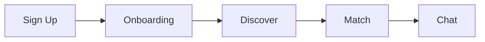
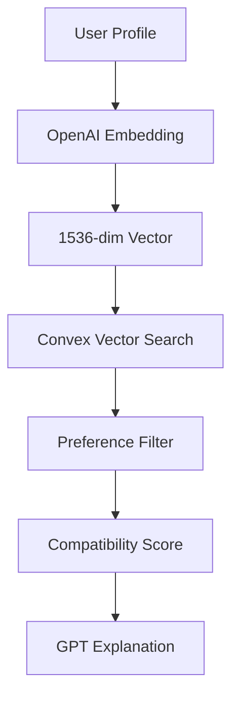
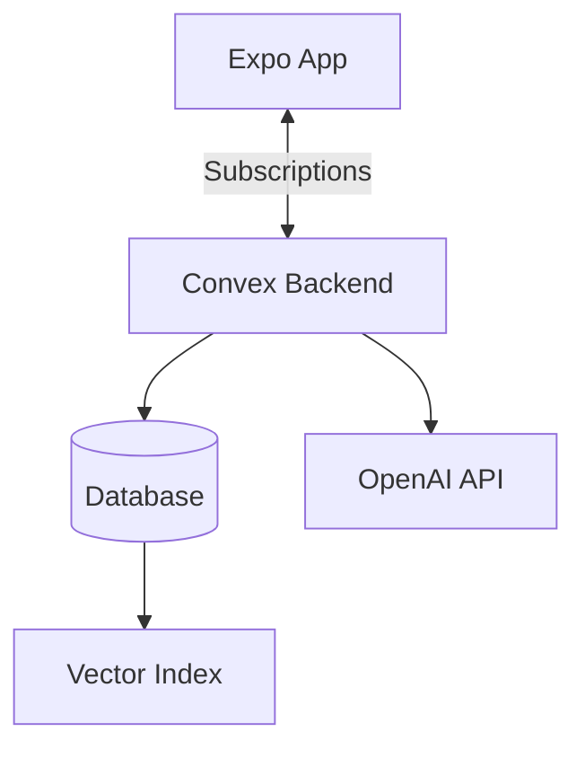

# Heartly - AI-Powered Dating App

[](https://creativecommons.org/licenses/by-nc/4.0/)
[](https://expo.dev)
[](https://reactnative.dev)
[](https://convex.dev)
[](https://clerk.com)
[](https://openai.com)

> **Learn to build a production-ready dating app with AI matching, real-time chat, and modern mobile development patterns.**

---

<table>
<tr>
<td width="33%" valign="top">

### Who This Is For

Developers learning:
- React Native & Expo
- AI/ML integration
- Real-time backends
- Authentication flows
- Mobile app architecture

</td>
<td width="33%" valign="top">

### What You'll Learn

- Clerk authentication with protected routes
- OpenAI vector embeddings for matching
- Convex real-time subscriptions
- Expo SDK 55 cutting-edge features
- Production-ready patterns

</td>
<td width="33%" valign="top">

### Tech Highlights

- Liquid Glass UI (iOS 26)
- Reanimated v4 animations
- Material 3 dynamic theming
- Vector search (1536 dims)
- Optimistic UI updates

</td>
</tr>
</table>

---

## Disclaimer

> **This is an educational project created purely for learning purposes.**

- This project is inspired by popular dating apps for **educational demonstration only**
- We do **not** claim any ownership, trademark, or copyright over the concepts, designs, or features that may resemble existing applications
- Any similarity to existing products is unintentional and solely for teaching modern app development patterns
- This is **not** affiliated with, endorsed by, or connected to any commercial dating application
- If you believe any content infringes on your rights, please contact us immediately and we will address it promptly

This project exists to help developers learn React Native, AI integration, and real-time backend development through hands-on practice.

---

## Do This BEFORE You Get Started

> **Set up these accounts first - you'll need them to run the app!**

### Step 1: Get Clerk (Authentication)

Clerk handles all your authentication - sign up, sign in, protected routes, and user management. It's incredibly easy to set up and saves you weeks of work.

[**Sign up for Clerk**](https://go.clerk.com/aV0wpm7) - Free tier available

### Step 2: Get Expo & EAS (Development Builds)

Expo is how we build and deploy React Native apps. You'll need an Expo account to create development builds and submit to app stores.

[**Sign up for Expo**](https://expo.dev/?utm_source=youtube&utm_medium=sonny&utm_campaign=35663643-SDK%2055&utm_content=home) - Free tier available

### Also Required (Standard Links)

You'll also need accounts for these services:

- **Convex** (Real-time backend) - [convex.dev](https://convex.dev)
- **OpenAI** (AI embeddings & chat) - [platform.openai.com](https://platform.openai.com)

---

## What Is This App?

Think of Heartly as a **Tinder-style dating app with an AI matchmaker built in**. Instead of random swiping, the app uses OpenAI embeddings to find people with similar interests and personalities.

### Key Concepts Explained

| Concept | Simple Explanation |
|---------|-------------------|
| **Vector Embeddings** | Your profile (bio + interests) gets converted into a list of 1,536 numbers. People with similar numbers = similar personalities! |
| **Real-time Subscriptions** | When someone messages you, it appears instantly - no refresh needed. Convex handles this automatically. |
| **Compatibility Scoring** | The AI compares your "number list" with others and ranks them by similarity. Higher score = better match! |

### What You Can Build With These Patterns

- Dating & social apps
- AI-powered recommendation systems
- Real-time chat applications
- Any app that matches users by interests/preferences

---

## About This Project

This is a production-ready dating app built with modern mobile development technologies. The project demonstrates best practices for:

- Building full-stack React Native apps with Expo
- Integrating AI/ML into mobile applications
- Real-time backend development with Convex
- Authentication flows with Clerk
- Production deployment with EAS

---

## Features

### For Users (What It Does)

| Feature | Description |
|---------|-------------|
| **Discover Feed** | Like or reject profiles with tap buttons and smooth fade transitions |
| **AI Daily Picks** | 3 curated matches per day with AI explanations of why you're compatible |
| **Real-time Chat** | Instant messaging with your matches - no refresh needed |
| **Smart Filtering** | Filter by age, gender, and distance preferences |
| **Location-based** | Find people near you (with permission) |
| **Rich Profiles** | Photos, bio, interests, and more |

### Technical Features (What You'll Learn)

| Feature | Technology |
|---------|-----------|
| **Authentication** | Clerk with protected routes, secure token storage |
| **Real-time Backend** | Convex subscriptions, optimistic updates |
| **AI Embeddings** | OpenAI `text-embedding-3-small` (1536 dimensions) |
| **AI Explanations** | GPT-4o-mini for match compatibility explanations |
| **Modern UI** | Expo SDK 55 Liquid Glass effects (iOS 26) |
| **Animations** | React Native Reanimated v4 for smooth transitions |
| **Theming** | Material 3 dynamic color generation |
| **Haptics** | Tactile feedback for all interactions |

---

## How It Works

### User Flow



### AI Matching Pipeline



**How it works:**
1. Your bio and interests are sent to OpenAI
2. OpenAI converts them into a 1,536-number vector
3. Convex searches for similar vectors in the database
4. Results are filtered by your preferences (age, gender, distance)
5. GPT generates a human-readable explanation of compatibility

### Real-time Architecture



**Key insight:** Convex subscriptions mean your UI automatically updates when data changes - no polling, no manual refreshes!

---

## Getting Started

### Prerequisites

Before you begin, make sure you have:

- **Node.js 18+** - [Download](https://nodejs.org/)
- **pnpm** - Install with `npm install -g pnpm`
- **iOS Simulator** or physical iOS device
- **Clerk account** - [**Sign up for Clerk**](https://clerk.com) (handles all authentication)
- **Expo account** - [**Sign up for Expo**](https://expo.dev) (required for dev builds)
- **Convex account** - [Sign up](https://convex.dev)
- **OpenAI API key** - [Get one](https://platform.openai.com/api-keys)

### Step-by-Step Setup

#### 1. Clone the Repository

```bash
git clone https://github.com/tarak6984/AI-Dating-App-Expo-SDK-55-Clerk-Convex-OpenAI.git
cd AI-Dating-App-Expo-SDK-55-Clerk-Convex-OpenAI
```

#### 2. Install Dependencies

```bash
pnpm install
```

#### 3. Set Up Environment Variables

```bash
cp .env.example .env.local
```

#### 4. Configure Clerk

> Don't have Clerk yet? [**Sign up here**](https://go.clerk.com/aV0wpm7) - it's free to start!

1. Go to [Clerk Dashboard](https://dashboard.clerk.com)
2. Create a new application
3. Copy your **Publishable Key**
4. Add it to `.env.local`:

```bash
EXPO_PUBLIC_CLERK_PUBLISHABLE_KEY=pk_test_xxxxx
```

#### 5. Set Up Convex

```bash
npx convex dev
```

This will:
- Log you into Convex (if needed)
- Create a new project
- Give you a deployment URL

Add the URL to `.env.local`:

```bash
EXPO_PUBLIC_CONVEX_URL=https://your-deployment.convex.cloud
```

#### 6. Add OpenAI API Key

> **Important:** The OpenAI key goes in Convex Dashboard, NOT in your `.env.local` file!

1. Go to [Convex Dashboard](https://dashboard.convex.dev)
2. Select your project
3. Navigate to **Settings > Environment Variables**
4. Add: `OPENAI_API_KEY` = `sk-xxxxx`

#### 7. Create Development Build

> Don't have an Expo account? [**Sign up here**](https://expo.dev/?utm_source=youtube&utm_medium=sonny&utm_campaign=35663643-SDK%2055&utm_content=home) - required for EAS builds!

```bash
npx eas build --profile development --platform ios
```

Install the build on your device via Expo Orbit or QR code.

#### 8. Seed Demo Profiles

In the Convex Dashboard, go to **Functions** tab and run:

```
seed:seedDemoProfiles
```

This creates 10 sample profiles for testing.

#### 9. Run the App

```bash
pnpm start
```

### Environment Variables

```bash
# ===================================
# CLIENT-SIDE (Expo)
# ===================================

# Clerk Authentication (Required)
# Get this from: https://dashboard.clerk.com
EXPO_PUBLIC_CLERK_PUBLISHABLE_KEY=pk_test_xxxxx

# Convex Backend (Required)
# Run `npx convex dev` to get this URL
EXPO_PUBLIC_CONVEX_URL=https://your-deployment.convex.cloud

# ===================================
# SERVER-SIDE (Convex Dashboard)
# These are set in Convex Dashboard, NOT here!
# ===================================
# OPENAI_API_KEY=sk-xxxxx
# Set at: https://dashboard.convex.dev > Settings > Environment Variables
```

> **Security Note:** Never commit your `.env.local` file! It's already in `.gitignore`.

> **Tip:** Variables prefixed with `EXPO_PUBLIC_` are exposed to the client. Backend-only secrets (like `OPENAI_API_KEY`) should be set in Convex Dashboard instead.

---

## Database Schema

The app uses 5 tables in Convex. See [`convex/schema.ts`](convex/schema.ts) for the full schema.

| Table | Purpose | Key Fields |
|-------|---------|------------|
| **users** | User profiles | `name`, `bio`, `interests`, `photos`, `embedding` (1536-dim vector), `location`, `ageRange`, `lookingFor` |
| **matches** | Mutual likes | `user1Id`, `user2Id`, `matchedAt`, `aiExplanation` |
| **swipes** | Like/reject actions | `swiperId`, `swipedId`, `action`, `createdAt` |
| **messages** | Chat messages | `matchId`, `senderId`, `content`, `read` |
| **dailyPicks** | AI-curated picks | `userId`, `picks[]` (with scores & explanations), `expiresAt` |

### Key Indexes

- **Vector Index:** `users.by_embedding` - 1536 dimensions for similarity search
- **Swipe Lookups:** `swipes.by_swiper_and_swiped` - Fast duplicate checking
- **Match Queries:** Bidirectional indexes on `user1Id` and `user2Id`

---

## Project Structure

```
app/
├── (auth)/                 # Authentication screens
│   ├── sign-in.tsx
│   └── sign-up.tsx
├── (app)/
│   ├── (tabs)/             # Main tab screens
│   │   ├── index.tsx       # Discover (swipe feed)
│   │   ├── matches.tsx     # AI matches & daily picks
│   │   ├── chat.tsx        # Conversations list
│   │   └── profile.tsx     # Your profile
│   ├── onboarding/         # 10-step onboarding flow
│   │   ├── name.tsx
│   │   ├── birthday.tsx
│   │   ├── gender.tsx
│   │   ├── looking-for.tsx
│   │   ├── age-range.tsx
│   │   ├── interests.tsx
│   │   ├── bio.tsx
│   │   ├── photos.tsx
│   │   ├── location.tsx
│   │   └── complete.tsx
│   ├── chat/[id].tsx       # Individual chat screen
│   └── profile/[id].tsx    # Profile view modal

components/
├── glass/                  # Liquid Glass UI components
├── chat/                   # Chat components
├── profile/                # Profile & swipe components
├── matches/                # Match cards & modals
├── onboarding/             # Onboarding headers
└── ui/                     # Generic UI components

convex/
├── schema.ts               # Database schema
├── users.ts                # User queries/mutations
├── matches.ts              # Match logic + AI explanations
├── swipes.ts               # Swipe actions
├── messages.ts             # Chat messages
├── seed.ts                 # Demo data seeding
└── lib/
    ├── openai.ts           # OpenAI integration
    ├── compatibility.ts    # Matching logic
    ├── distance.ts         # Location calculations
    └── utils.ts            # Shared utilities

hooks/
├── useCurrentUser.ts       # Get logged-in user
├── useHapticPress.ts       # Haptic feedback
└── usePhotoPicker.ts       # Image selection

lib/
├── theme.ts                # Material 3 theming
├── haptics.ts              # Haptic feedback utilities
└── constants/              # App constants
```

---

## Deployment

### Expo/EAS Build

#### Development Build (for testing)

```bash
npx eas build --profile development --platform ios
```

#### Production Build

```bash
npx eas build --profile production --platform ios
```

#### Submit to App Store

```bash
npx eas submit --platform ios
```

### Convex Deployment

Development (local):
```bash
npx convex dev
```

Production:
```bash
npx convex deploy
```

### Post-Deployment Checklist

- [ ] Environment variables set in Convex Dashboard
- [ ] Clerk production keys configured
- [ ] OpenAI API key has sufficient credits
- [ ] Test user authentication flow
- [ ] Test matching and chat functionality
- [ ] Verify vector search is working

---

## Common Issues & Solutions

### Development

| Issue | Solution |
|-------|----------|
| **Metro bundler won't start** | Run `pnpm start --clear` to clear cache |
| **Dev client crashes on launch** | Rebuild with `npx eas build --profile development --platform ios` |
| **Changes not reflecting** | Restart Convex with `npx convex dev` |

### Authentication

| Issue | Solution |
|-------|----------|
| **"Invalid token" errors** | Check your Clerk Publishable Key is correct |
| **Can't sign in** | Ensure Clerk app has email/password enabled |
| **Protected routes not working** | Verify `ClerkProvider` wraps your app in `_layout.tsx` |

### Database

| Issue | Solution |
|-------|----------|
| **No profiles showing** | Run `seed:seedDemoProfiles` in Convex Dashboard |
| **Vector search returns empty** | Ensure user has `embedding` field (run onboarding) |
| **Real-time not updating** | Check Convex connection in browser devtools |

### AI

| Issue | Solution |
|-------|----------|
| **"OpenAI API key invalid"** | Verify key in Convex Dashboard (Settings > Environment Variables) |
| **Embeddings not generating** | Check OpenAI has credits and key has permissions |
| **Match explanations empty** | Verify GPT-4o-mini access on your OpenAI account |

---

## Take It Further - Challenge Time!

Ready to level up? Here are some features you can add:

### Feature Ideas

- **Super Likes** - Limited daily count, highlighted in the recipient's feed
- **Icebreakers** - GPT-generated conversation starters based on shared interests
- **Video Profiles** - Add video clips using `expo-av`
- **Unmatch** - Let users unmatch and delete conversations
- **Verification Badges** - Photo verification system
- **Block/Report** - Safety features for users

### AI Improvements

- **Better Matching** - Add personality questions and weight them in embeddings
- **Smart Suggestions** - "You both love hiking!" notifications
- **Conversation Coach** - GPT suggestions for keeping conversations going
- **Profile Optimization** - AI feedback on profile quality

### Infrastructure & Scaling

- **Push Notifications** - Expo Notifications for new matches/messages
- **Analytics** - Track user engagement with Amplitude or Mixpanel
- **Admin Dashboard** - Moderation tools with React Admin
- **Rate Limiting** - Prevent spam and abuse

### Monetization (for learning)

- **Premium Tier** - Unlimited likes, see who liked you
- **Boost** - Temporarily increase visibility
- **Super Likes** - Pay for more daily super likes

---

## License & Legal

This project is licensed under [CC BY-NC 4.0](https://creativecommons.org/licenses/by-nc/4.0/).

### You CAN

- Use this code for **learning and personal projects**
- Modify and build upon it
- Share it with attribution

### You CANNOT

- Use it for **commercial purposes**
- Sell or monetize apps built with this code
- Remove attribution

### Trademark Notice

- This is an **educational clone** for learning purposes only
- We make **no trademark claims** on app concepts, designs, or features
- Any resemblance to existing products is for educational demonstration
- For concerns, please open an issue or contact us directly

See [LICENSE.md](LICENSE.md) for full details.

---

## Quick Reference

### Useful Commands

```bash
# Install dependencies
pnpm install

# Start Expo dev server
pnpm start

# Start Convex backend
npx convex dev

# Create iOS development build
npx eas build --profile development --platform ios

# Create Android development build
npx eas build --profile development --platform android

# Deploy Convex to production
npx convex deploy

# Lint code
pnpm lint
```

### Key Files

| File | Purpose |
|------|---------|
| `convex/schema.ts` | Database schema definition |
| `convex/matches.ts` | AI matching logic |
| `convex/lib/openai.ts` | OpenAI integration |
| `app/(app)/(tabs)/_layout.tsx` | Tab navigation with Liquid Glass |
| `lib/theme.ts` | Material 3 theming |
| `hooks/useCurrentUser.ts` | Current user hook |

### Important Concepts

| Concept | Location |
|---------|----------|
| Vector embeddings | `convex/users.ts` - `updateUserWithEmbedding` |
| Compatibility check | `convex/lib/compatibility.ts` |
| Daily picks generation | `convex/matches.ts` - `generateDailyPicks` |
| Swipe logic | `convex/swipes.ts` - `createSwipe` |
| Real-time chat | `convex/messages.ts` |

---

## Contributing

Contributions are welcome! Please feel free to submit a Pull Request.

## Support

If you have any questions or run into issues, please open an issue on GitHub.
